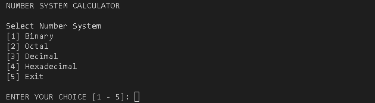

# Number System Calculator

This is my Final Project for my subject called Object Oriented Programming.

This project is for number system that you can calculate binary, octal, decimal and hexadecimal using arithmetic operations like
addition, subtraction, multiplication and division.

**For Number System panel.**

**For Arithmetic Operation panel.**

